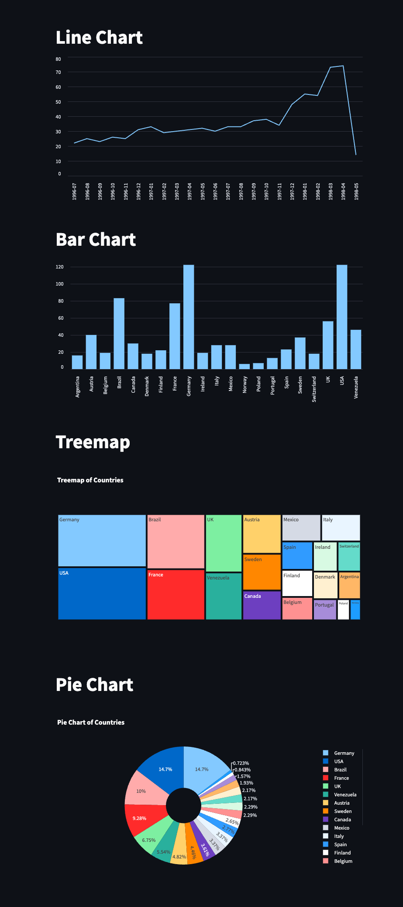

# dxcodingcamp-python


## FastAPI

```
python -m venv ~/.venv/dxcodingcamp-python
source ~/.venv/dxcomdingcamp-python

pip install "fastapi[standard]"
```

```bash
fastapi dev app.py
```

## Streamlit
```
python -m venv ~/.venv/dxcodingcamp-python
source ~/.venv/dxcomdingcamp-python

pip install streamlit pyplot
```

```bash
streamlit run visualize.py
```


